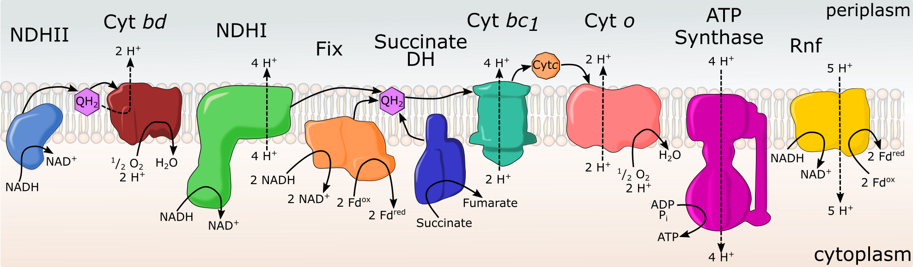

# Azotobactervinelandii_metabolicmodel
Genome scale metabolic model describing aerobic nitrogen fixation in Azotobacter vinelandii 

This is the corresponding model curation and analysis to the manuscript *Metabolic model of nitrogen-fixing obligate aerobe Azotobacter vinelandii demonstrates adaptation to oxygen concentration and metal availability.* Found at bioArxiv link

Abstract:
	There is considerable interest in promoting biological nitrogen fixation as a mechanism to reduce the inputs of nitrogenous fertilizers in agriculture, a problem of agronomic, economic, and environmental importance. For the potential impact of biological nitrogen fixation in agriculture to be realized, there are considerable fundamental knowledge gaps that need to be addressed. Biological nitrogen fixation or the reduction of N2 to NH3 is catalyzed by nitrogenase which requires a large amount of energy in the form of ATP and low potential electrons. Nitrogen-fixing organisms that respire aerobically have an advantage in meeting the energy demands of biological nitrogen fixation but face challenges of protecting nitrogenase from inactivation in the presence of oxygen. Here, we have constructed a genome-scale metabolic model of the aerobic metabolism of nitrogen-fixing bacteria Azotobacter vinelandii, which uses a complex electron transport system, termed respiratory protection, to consume oxygen at a high rate keeping intracellular conditions microaerobic. Our model accurately determines growth rate under high oxygen and high substrate concentration conditions, demonstrating the large flux of energy directed to respiratory protection. While respiratory protection mechanisms compensate the energy balance in high oxygen conditions, it does not account for all substrate intake, leading to increased maintenance rates. We have also shown how A. vinelandii can adapt under different oxygen concentrations and metal availability by rearranging flux through the electron transport system. Accurately determining the energy balance in a genome-scale metabolic model is required for future engineering approaches.

Importance: 
The world’s dependence on industrially produced nitrogenous fertilizers has created a dichotomy of issues. Some parts of the globe lack access to fertilizers and associated poor crop yields, significantly limiting nutrition, contributing to disease and starvation. In contrast, in other parts of the world, abundant nitrogenous fertilizers and associated overuse result in compromised soil quality and downstream environmental issues. There is considerable interest in expanding the impacts of biological nitrogen fixation to promote improved crop yields in places struggling with access to industrial fertilizers and reducing fertilizers’ inputs in areas where overuse is resulting in the degradation of soil health and other environmental problems. A more robust and fundamental understanding of biological nitrogen fixation’s biochemistry and microbial physiology will enable strategies to promote new and more robust associations between nitrogen-fixing microorganisms and crop plants.

## Organization of repository 
This repository has three folder Data, Notebooks, and Outputs

**Data** folder contains all models, input and analysis data, and eshcher maps. 

**Notebooks** contain all analysis files in the form of jupyter notebooks or figure production in python scripts. 

**Outputs** folder is mostly figures and graphs from anaylsis in low resolution. 

Model data was received from Tec-Campos et al. (
https://doi.org/10.1016/j.mec.2020.e00132) and coresponding github (https://github.com/cristalzucsd/AvinelandiiDJ) or recived from the BiGG Model database

Experimental data from: Kuhla and Oelze, 1988, Dependency of growth yield, maintenance and Ks-values on the dissolved oxygen concentration in continuous cultures of <i>Azotobacter vinelandii</i>

